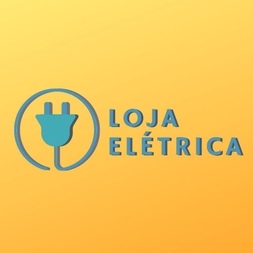

# Loja Elétrica - Cadastro de clientes, produtos e vendas

Projeto desenvolvido para as matérias de linguagens de programação e banco de dados do curso da Analise e Desenvolvimento de Sistemas  da Facens, consiste em um programa que cadastra clientes e produtos e realiza vendas. Desenvolvido com java, Swing UI e MySQL.

# Loja Elétrica - Logo

<h2 align="center">
   
</h2>
